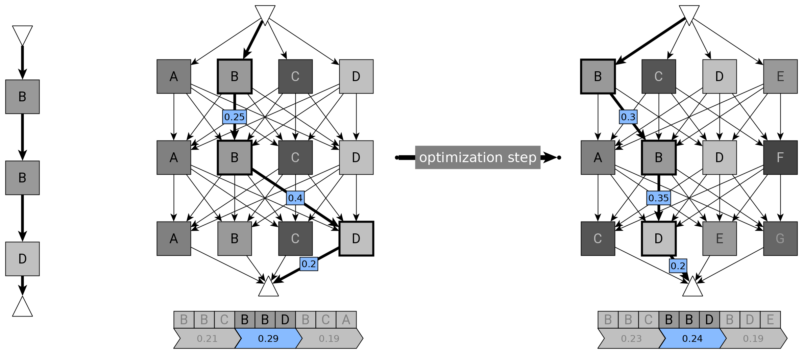

# FaDE - FAst Darts Estimator on Hierarchical NAS Spaces



# Reproduction Steps
- Create conda environment: ``conda env create -f env-fade.yml``
- (or use the explicit version of a locally resolved environment with ``conda create --name env-fade --file env-fade.txt``)
- Activate it, e.g. ``conda env update env-fade``

**Experiments**
- invoke e.g. ``python main.py`` (you can use PyCharm with the configured conda environment)

**Notebooks**
- start ``jupyter notebook`` within activated environment
- select one of the *analysis_xxx.ipynb* files for inspection
- see the sys path append call in the import cell for importing sources from the fade/ directory


# Development Notes
- Running pre-commit ``pre-commit run --all-files``
- Install pre-commit as a git hook ``pre-commit install``, update pre-commit via ``pre-commit autoupdate``
- Extracting the exact environment specs from conda: ``conda list --explicit > env-fade.txt``
- Possibly update environment from changed dependency description ``conda env update -f env-fade.yml``


# Reference
We'd love if you cite our work if you use the code or build upon it:
```bibtex
@unpublished{fade2023anonymous,
    author  = {Anonymous et al},
    title   = {FaDE: Fast DARTS Estimator on Hierarchical NAS Spaces},
    year    = {2023},
    note    = {unpublished},
}
```
